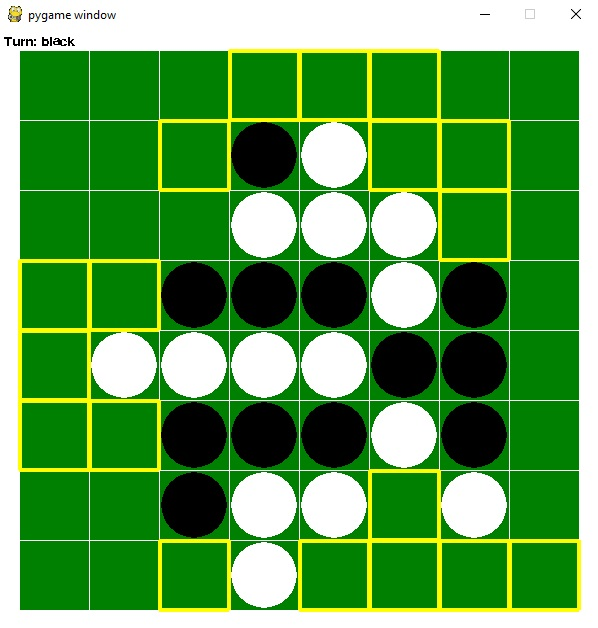

= Artificial Othello

AOthello offers an easy to use API for testing your othello playing AI.

=== Dependencies

- https://www.python.org/downloads/[Python 3.x]
- https://www.pygame.org/news[pygame]

 $pip install pygame

=== Usage

[source, python]

----
# Inherit a player class from IPlayer interface.
from player import IPlayer

class AIPlayer(IPlayer):
----

[source, python]

----
# Implement make_move(board, viable_moves) method
# viable_moves is a list of PlayerMove object
# PlayerMove class consists of position, pieces_to_flip and player_color variables
def make_move(self, board, viable_moves):
        # This puts a white piece in the cell (3, 2) if that cell is a viable location
        if board.is_move_viable((3, 2)):
            return (3, 2)
----

[source, python]

----
# Initialize the game and make your custom player class play as the whites.
game = Game(600, 600)
# HumanPlayer class is built-in in case you want to play against your AI.
game.set_black_player(HumanPlayer())
game.set_white_player(AIPlayer())
game.run()
----